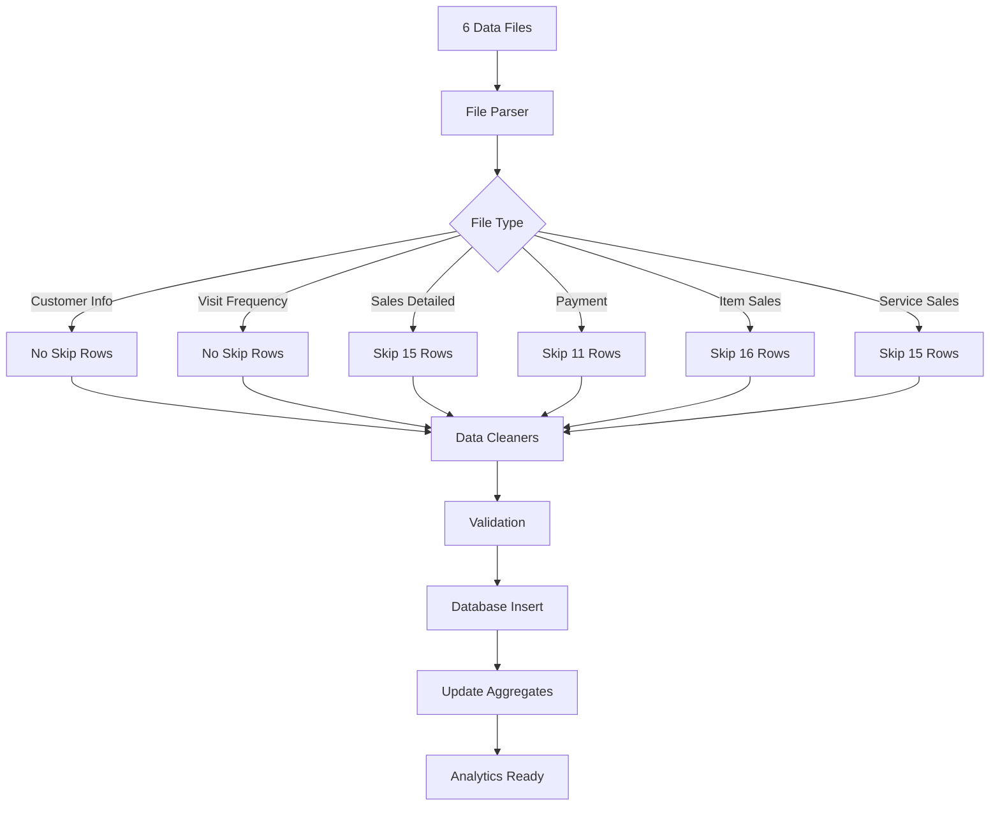

# AINAA CLINIC DASHBOARD - SYSTEM DESIGN DOCUMENT

## Table of Contents
1. [Executive Summary](#executive-summary)
2. [Data Analysis Summary](#data-analysis-summary)
3. [User Requirements Specification (URS)](#user-requirements-specification-urs)
4. [System Requirements Specification (SRS)](#system-requirements-specification-srs)
5. [Data Architecture](#data-architecture)
6. [UI/UX Design Specifications](#uiux-design-specifications)
7. [Analytics Framework](#analytics-framework)
8. [Implementation Plan](#implementation-plan)

---

## Executive Summary

The Ainaa Clinic Dashboard is a comprehensive analytics and customer relationship management system designed to process and visualize data from 6 interconnected reports from the Aoikumo clinic system. The system tracks 3,879 customers, RM 6.66M in total sales, and provides actionable insights for marketing campaigns and daily operational decisions.

### Key Business Metrics
- **Total Customers:** 3,879
- **Total Revenue:** RM 6,661,985.46
- **Total Payments:** RM 5,977,559.46
- **Outstanding Receivables:** RM 684,426.00
- **Service Sales:** RM 4,054,560.43 (60.9%)
- **Item Sales:** RM 2,652,576.53 (39.8%)

---

## Data Analysis Summary

### The 6 Data Files

| File | Type | Header Row | Records | Key Data |
|------|------|------------|---------|----------|
| Customer Info Listing | CSV | 1 | 3,879 | Master demographics, IC#, medical info |
| Customer Visit Frequency | CSV | 1 | 2,683 | Aggregated visit metrics, spending |
| Sales Detailed | CSV | 16 | 12,777 | Transaction summaries, SO# |
| Payment Detailed | Excel | 12 | 14,688 | Payment records, modes, outstanding |
| Item Sales | Excel | 17 | 21,757 | Product line items, brands, SKUs |
| Service Sales | CSV | 16 | 7,763 | Service line items, treatments |

### Primary Key Structure
- **Primary Linking Key:** Membership # (Format: ACB######)
- **Secondary Identifier:** IC Number (only in Customer Info & Visit Frequency)
- **Transaction Keys:** SO# (Sales Order), Invoice#

---

## User Requirements Specification (URS)

### 1. Business Objectives

#### 1.1 Marketing Campaign Support
- **Customer Segmentation:** Identify high-value, at-risk, and growth-potential segments
- **Campaign ROI Tracking:** Measure effectiveness of promotions and discounts
- **Customer Acquisition:** Track new customer sources and conversion rates
- **Retention Analysis:** Monitor churn and implement retention strategies

#### 1.2 Operational Decision Support
- **Daily Revenue Monitoring:** Real-time sales and payment tracking
- **Staff Performance:** Consultant and sales person metrics
- **Service Utilization:** Capacity planning and popular service identification
- **Inventory Management:** Product sales trends and stock optimization

#### 1.3 Financial Management
- **Outstanding Receivables:** Track and prioritize RM 684K in outstanding payments
- **Payment Pattern Analysis:** Understand payment modes and timing
- **Cash Flow Forecasting:** Predict revenue based on appointments and history

### 2. User Personas

| Persona | Primary Needs | Key Metrics |
|---------|--------------|-------------|
| Clinic Owner | Strategic overview, growth trends | Total revenue, customer growth, profitability |
| Marketing Manager | Campaign performance, customer insights | CLV, CAC, retention rate, segment performance |
| Operations Manager | Daily operations, staff utilization | Daily revenue, appointments, service queue |
| Finance Manager | Cash flow, receivables | Outstanding balance, payment collection rate |
| Front Desk Staff | Customer lookup, appointment info | Customer profile, visit history, alerts |

### 3. Functional Requirements

#### 3.1 Data Management
- Import and process 6 different file formats with varying header positions
- Handle ~50,000+ transaction records efficiently
- Maintain data relationships via Membership #
- Support incremental data updates

#### 3.2 Customer Management
- **Customer 360° View:** Complete profile with all interactions
- **Search Capabilities:** By Membership #, IC Number, Name, Phone
- **Medical Information:** Allergies, conditions, alerts
- **Visit History:** Timeline of all services and purchases

#### 3.3 Analytics & Reporting
- **Customer Analytics:** LTV, visit frequency, spending patterns
- **Service Analytics:** Popular services, revenue by category
- **Product Analytics:** Best sellers, brand performance
- **Payment Analytics:** Collection rates, payment modes
- **Staff Analytics:** Performance metrics, commission tracking

#### 3.4 User Interface Requirements
- **Modern Design:** Clean, minimal aesthetic with subtle colors
- **Responsive Layout:** Desktop and tablet optimized
- **Data Visualization:** Interactive charts with gradient effects
- **Bento Grid Layout:** Organized card-based information display

---

## System Requirements Specification (SRS)

### 1. Technical Architecture

#### 1.1 Technology Stack
```
Frontend:
- React 18 with TypeScript
- Vite 5.4+ build tool
- Tailwind CSS for styling
- shadcn/ui component library
- Recharts for data visualization
- Framer Motion for animations

Backend:
- Supabase (PostgreSQL)
- Row Level Security (RLS)
- Real-time subscriptions

Data Processing:
- XLSX for Excel parsing
- PapaParse for CSV parsing
- Custom data cleaners
```

#### 1.2 Performance Requirements
- Dashboard load time: < 2 seconds
- Search response: < 500ms
- File upload processing: < 30 seconds for all 6 files
- Concurrent users: Support 10+ simultaneous users

### 2. Database Schema

#### 2.1 Enhanced Tables Structure

```sql
-- Enhanced customers table
CREATE TABLE customers (
  id UUID PRIMARY KEY DEFAULT gen_random_uuid(),
  membership_number TEXT UNIQUE NOT NULL, -- Primary identifier
  ic_number TEXT, -- Secondary identifier
  name TEXT NOT NULL,
  email TEXT,
  phone TEXT,
  phone2 TEXT,

  -- Demographics
  age INTEGER,
  birth_date DATE,
  marital_status TEXT,
  occupation TEXT,
  income_range TEXT,
  race TEXT,
  religion TEXT,
  preferred_language TEXT,

  -- Medical
  drug_allergies TEXT,
  medical_conditions TEXT,
  alerts TEXT,
  smoker BOOLEAN DEFAULT false,

  -- Address
  address1 TEXT,
  address2 TEXT,
  address3 TEXT,
  city TEXT,
  state TEXT,
  postcode TEXT,
  country TEXT DEFAULT 'Malaysia',

  -- Membership
  membership_type TEXT DEFAULT 'BRONZE',
  consultant TEXT,
  outlet TEXT,
  vip BOOLEAN DEFAULT false,
  deceased BOOLEAN DEFAULT false,

  -- Referral
  referrer TEXT,
  referrer_contact TEXT,
  referrer_relationship TEXT,

  -- Preferences
  system_notifications BOOLEAN DEFAULT true,
  promotional_notifications BOOLEAN DEFAULT true,

  -- Timestamps
  created_date DATE,
  created_time TIME,
  last_visit_date DATE,
  last_visit_time TIME,
  created_at TIMESTAMP WITH TIME ZONE DEFAULT NOW()
);

-- Customer visit frequency table
CREATE TABLE customer_visit_frequency (
  id UUID PRIMARY KEY DEFAULT gen_random_uuid(),
  customer_id UUID REFERENCES customers(id) ON DELETE CASCADE,
  membership_number TEXT REFERENCES customers(membership_number),

  -- Spending metrics
  total_spent DECIMAL(12,2) DEFAULT 0,
  spent_for_period DECIMAL(12,2) DEFAULT 0,

  -- Visit metrics
  total_visits INTEGER DEFAULT 0,
  avg_visit_week DECIMAL(5,2) DEFAULT 0,
  avg_visit_month DECIMAL(5,2) DEFAULT 0,
  avg_visit_year DECIMAL(5,2) DEFAULT 0,

  -- Monthly breakdown
  visits_oct_2025 INTEGER DEFAULT 0,
  visits_sep_2025 INTEGER DEFAULT 0,
  visits_aug_2025 INTEGER DEFAULT 0,

  -- Last activity
  last_visit_action TEXT,
  transaction_count INTEGER DEFAULT 0,

  created_at TIMESTAMP WITH TIME ZONE DEFAULT NOW(),
  updated_at TIMESTAMP WITH TIME ZONE DEFAULT NOW()
);

-- Enhanced transactions table
CREATE TABLE transactions (
  id UUID PRIMARY KEY DEFAULT gen_random_uuid(),
  customer_id UUID REFERENCES customers(id) ON DELETE CASCADE,
  so_number TEXT UNIQUE NOT NULL, -- Sales Order #
  invoice_number TEXT,

  -- Transaction details
  transaction_date DATE NOT NULL,
  transaction_time TIME,
  transaction_type TEXT,
  outlet TEXT,

  -- Financial summary
  sub_total DECIMAL(12,2) DEFAULT 0,
  voucher_amount DECIMAL(12,2) DEFAULT 0,
  discount_amount DECIMAL(12,2) DEFAULT 0,
  cw_amount DECIMAL(12,2) DEFAULT 0, -- Cash Wallet
  cw_tax DECIMAL(12,2) DEFAULT 0,
  gross_amount DECIMAL(12,2) DEFAULT 0,
  tax_value DECIMAL(12,2) DEFAULT 0,
  cancelled_amount DECIMAL(12,2) DEFAULT 0,
  cw_cancelled DECIMAL(12,2) DEFAULT 0,
  rounding DECIMAL(12,2) DEFAULT 0,
  nett_amount DECIMAL(12,2) DEFAULT 0,

  -- Payment status
  payment_to_date DECIMAL(12,2) DEFAULT 0,
  outstanding_amount DECIMAL(12,2) DEFAULT 0,

  -- Staff
  sales_person TEXT,
  processed_by TEXT,
  sales_notes TEXT,

  created_at TIMESTAMP WITH TIME ZONE DEFAULT NOW()
);

-- Service sales table (37 columns)
CREATE TABLE service_sales (
  id UUID PRIMARY KEY DEFAULT gen_random_uuid(),
  transaction_id UUID REFERENCES transactions(id) ON DELETE CASCADE,
  customer_id UUID REFERENCES customers(id) ON DELETE CASCADE,

  -- Transaction reference
  sales_number TEXT,
  invoice_number TEXT,
  sale_date DATE NOT NULL,
  sale_time TIME,
  sale_type TEXT,

  -- Service details
  service_type TEXT, -- FACIAL, LASER, CHEMICAL PEEL, etc.
  sku TEXT,
  service_name TEXT NOT NULL,
  quantity INTEGER DEFAULT 1,

  -- Pricing
  original_retail_price DECIMAL(12,2),
  gross_amount DECIMAL(12,2),
  voucher_amount DECIMAL(12,2) DEFAULT 0,
  discount_amount DECIMAL(12,2) DEFAULT 0,
  nett_before_deduction DECIMAL(12,2),
  nett_amount DECIMAL(12,2),

  -- Promotions
  promo TEXT,
  promo_group TEXT,

  -- Tax
  tax_name TEXT,
  tax_rate DECIMAL(5,2),
  tax_amount DECIMAL(12,2),

  -- Cash Wallet
  cw_used_gross DECIMAL(12,2) DEFAULT 0,
  cw_used_tax DECIMAL(12,2) DEFAULT 0,
  cw_cancelled_gross DECIMAL(12,2) DEFAULT 0,
  cw_cancelled_tax DECIMAL(12,2) DEFAULT 0,

  -- Cancellations
  cancelled_gross DECIMAL(12,2) DEFAULT 0,
  cancelled_tax DECIMAL(12,2) DEFAULT 0,

  -- Payment details
  payment_amount DECIMAL(12,2),
  payment_outstanding DECIMAL(12,2),
  payment_mode TEXT,
  payment_type TEXT,
  approval_code TEXT,
  bank TEXT,

  -- Staff
  sales_person TEXT,
  processed_by TEXT,

  created_at TIMESTAMP WITH TIME ZONE DEFAULT NOW()
);

-- Indexes for performance
CREATE INDEX idx_customers_membership ON customers(membership_number);
CREATE INDEX idx_customers_ic ON customers(ic_number);
CREATE INDEX idx_customers_phone ON customers(phone);
CREATE INDEX idx_transactions_so ON transactions(so_number);
CREATE INDEX idx_transactions_customer ON transactions(customer_id);
CREATE INDEX idx_transactions_date ON transactions(transaction_date);
CREATE INDEX idx_service_sales_type ON service_sales(service_type);
CREATE INDEX idx_visit_frequency_customer ON customer_visit_frequency(customer_id);
```

### 3. Data Processing Pipeline



---

## Data Architecture

### Entity Relationship Diagram

```
┌─────────────────────────────────────────────────────────────┐
│                    CUSTOMER (Master)                        │
│                 [Membership # - Primary Key]                │
│                    [IC Number - Alt Key]                    │
├─────────────────────────────────────────────────────────────┤
│ Demographics | Contact | Medical | Membership | Preferences │
└─────────────────────────────────────────────────────────────┘
                              │
                              │ 1:N
                              ▼
┌─────────────────────────────────────────────────────────────┐
│                    TRANSACTIONS                             │
│                  [SO # - Primary Key]                       │
├─────────────────────────────────────────────────────────────┤
│ Date/Time | Amounts | Discounts | Outstanding | Staff      │
└─────────────────────────────────────────────────────────────┘
                              │
                ┌─────────────┼─────────────┐
                │             │             │
                │ 1:N         │ 1:N         │ 1:N
                ▼             ▼             ▼
    ┌──────────────┐ ┌──────────────┐ ┌──────────────┐
    │ ITEM SALES  │ │SERVICE SALES │ │   PAYMENTS   │
    ├──────────────┤ ├──────────────┤ ├──────────────┤
    │ Products     │ │ Treatments   │ │ Payment Info │
    │ SKU/Brand    │ │ Service Type │ │ Mode/Bank    │
    │ Quantities   │ │ Pricing      │ │ Outstanding  │
    └──────────────┘ └──────────────┘ └──────────────┘
                              │
                              │ Aggregates to
                              ▼
                ┌─────────────────────────────┐
                │   CUSTOMER VISIT FREQUENCY   │
                ├─────────────────────────────┤
                │ Total Spent | Visit Metrics │
                │ Monthly Breakdown | Averages │
                └─────────────────────────────┘
```

### Data Flow

1. **Customer Registration** → Customer Master Record
2. **Service Booking** → Transaction Created
3. **Service Delivery** → Service Sales Record
4. **Product Purchase** → Item Sales Record
5. **Payment Processing** → Payment Record
6. **Analytics Update** → Visit Frequency Aggregation

---

## UI/UX Design Specifications

### 1. Design System

#### 1.1 Color Palette
```css
:root {
  /* Primary Colors */
  --primary: hsl(214, 100%, 50%);      /* Soft Blue */
  --primary-foreground: hsl(0, 0%, 100%);

  /* Neutral Colors */
  --background: hsl(0, 0%, 98%);       /* Off-white */
  --foreground: hsl(0, 0%, 10%);       /* Near black */
  --card: hsl(0, 0%, 100%);            /* White */
  --card-foreground: hsl(0, 0%, 10%);

  /* Semantic Colors */
  --muted: hsl(0, 0%, 94%);
  --muted-foreground: hsl(0, 0%, 40%);
  --accent: hsl(214, 100%, 45%);
  --accent-foreground: hsl(0, 0%, 100%);

  /* Status Colors */
  --success: hsl(142, 71%, 45%);
  --warning: hsl(45, 93%, 47%);
  --error: hsl(0, 84%, 60%);

  /* Borders & Radius */
  --border: hsl(0, 0%, 90%);
  --radius: 0.5rem;
}
```

#### 1.2 Typography
```css
/* Font Family */
--font-sans: 'Inter', system-ui, -apple-system, sans-serif;

/* Font Sizes */
--text-xs: 0.75rem;    /* 12px */
--text-sm: 0.875rem;   /* 14px */
--text-base: 1rem;     /* 16px */
--text-lg: 1.125rem;   /* 18px */
--text-xl: 1.25rem;    /* 20px */
--text-2xl: 1.5rem;    /* 24px */
--text-3xl: 1.875rem;  /* 30px */

/* Font Weights */
--font-normal: 400;
--font-medium: 500;
--font-semibold: 600;
--font-bold: 700;
```

### 2. Component Library

#### 2.1 Base Components (shadcn/ui)
- **Card:** Container with subtle shadow
- **Button:** Primary, secondary, outline variants
- **Input:** Form inputs with validation states
- **Select:** Dropdown selectors
- **Table:** Data tables with sorting
- **Dialog:** Modal dialogs
- **Toast:** Notifications
- **Tabs:** Tab navigation
- **Badge:** Status indicators

#### 2.2 Custom Components

##### BentoCard Component
```typescript
interface BentoCardProps {
  title: string;
  subtitle?: string;
  value?: string | number;
  trend?: number;
  icon?: React.ReactNode;
  gradient?: boolean;
  size?: 'sm' | 'md' | 'lg' | 'xl';
  className?: string;
}
```

##### GradientChart Component
```typescript
interface GradientChartProps {
  data: any[];
  type: 'line' | 'area' | 'bar';
  dataKey: string;
  gradientColors: [string, string];
  height?: number;
}
```

##### StatCard Component
```typescript
interface StatCardProps {
  label: string;
  value: number | string;
  prefix?: string;
  suffix?: string;
  trend?: {
    value: number;
    isPositive: boolean;
  };
  icon?: React.ReactNode;
}
```

### 3. Page Layouts

#### 3.1 Customer Profile Page

##### Layout Structure (Bento Grid)
```
┌─────────────────────────────────┬──────────────────┐
│   Customer Info & Avatar        │  Lifetime Stats  │
│          (2x1)                  │      (1x1)       │
├─────────────────────────────────┼──────────────────┤
│                                 │                  │
│   Visit Frequency Chart         │  Recent Services │
│          (2x2)                  │      (1x2)       │
│                                 │                  │
├─────────────┬─────────────┬─────┴──────────────────┤
│   Payment   │ Outstanding │    Loyalty Status     │
│    (1x1)    │    (1x1)    │        (1x1)         │
├─────────────┴─────────────┴──────────────────────────┤
│              Purchase Timeline (3x1)                 │
└───────────────────────────────────────────────────────┘
```

##### Key Components
1. **Customer Info Card**
   - Avatar with initials
   - Name, Membership #, IC Number
   - Contact details
   - Medical alerts badge

2. **Lifetime Stats**
   - Total Spent (with animation)
   - Total Visits
   - Member Since
   - Last Visit

3. **Visit Frequency Chart**
   - Line chart with gradient fill
   - Monthly trend over 12 months
   - Hover tooltips

4. **Recent Services**
   - Last 5 services
   - Service type icons
   - Dates and amounts

5. **Payment History**
   - Payment modes pie chart
   - Average payment time

6. **Outstanding Balance**
   - Current outstanding
   - Aging indicator
   - Payment reminder status

7. **Loyalty Status**
   - Current tier (Bronze/Silver/Gold)
   - Points/Credits available
   - Next tier progress

8. **Purchase Timeline**
   - Horizontal timeline
   - Services vs Products
   - Interactive hover details

#### 3.2 Marketing Analytics Dashboard

##### Key Metrics Row
```
┌──────────┬──────────┬──────────┬──────────┬──────────┐
│   CLV    │   CAC    │Retention │ Campaign │ Segment  │
│  Stats   │  Trends  │   Rate   │   ROI    │  Value   │
└──────────┴──────────┴──────────┴──────────┴──────────┘
```

##### Analytics Grid
```
┌─────────────────────────┬───────────────────────────┐
│  Customer Segments      │  Campaign Performance     │
│  (Donut Chart)          │  (Bar Chart)              │
├─────────────────────────┼───────────────────────────┤
│  Cohort Analysis        │  Service Popularity       │
│  (Heatmap)              │  (Area Chart)             │
├─────────────────────────┴───────────────────────────┤
│           Predictive Analytics (Line Charts)        │
└──────────────────────────────────────────────────────┘
```

#### 3.3 Operations Dashboard

##### Real-time Metrics
```
┌────────┬────────┬────────┬────────┬────────┬────────┐
│Today's │ Active │Service │Payment │ Staff  │Customer│
│Revenue │Appoint.│ Queue │Collect.│ Online │Waiting │
└────────┴────────┴────────┴────────┴────────┴────────┘
```

##### Operations Grid
```
┌─────────────────────────┬───────────────────────────┐
│  Hourly Revenue         │  Staff Performance        │
│  (Line Chart)           │  (Bar Chart)              │
├─────────────────────────┼───────────────────────────┤
│  Service Utilization    │  Payment Collection       │
│  (Gauge Charts)         │  (Progress Bars)          │
└─────────────────────────┴───────────────────────────┘
```

---

## Analytics Framework

### 1. Marketing Analytics

#### 1.1 Customer Lifetime Value (CLV)
```typescript
interface CLVMetrics {
  totalSpent: number;
  averageOrderValue: number;
  purchaseFrequency: number;
  customerLifespan: number;
  predictedCLV: number;
}

// Calculation
CLV = AOV × Purchase Frequency × Customer Lifespan
```

#### 1.2 Customer Acquisition Cost (CAC)
```typescript
interface CACMetrics {
  marketingSpend: number;
  newCustomers: number;
  cac: number;
  paybackPeriod: number;
}

// Calculation
CAC = Total Marketing Spend / New Customers Acquired
```

#### 1.3 Retention Analysis
```typescript
interface RetentionMetrics {
  retentionRate: number;
  churnRate: number;
  repeatPurchaseRate: number;
  averageTimeBetweenPurchases: number;
}
```

#### 1.4 Segment Analysis
```typescript
enum CustomerSegment {
  VIP = "VIP",              // Top 10% by CLV
  LOYAL = "Loyal",          // Regular visitors (>6 visits/year)
  GROWTH = "Growth",        // Increasing spend trend
  AT_RISK = "At Risk",      // Declining visits
  DORMANT = "Dormant",      // No visit >6 months
  NEW = "New"               // First 3 visits
}
```

### 2. Operational Analytics

#### 2.1 Service Performance
```typescript
interface ServiceMetrics {
  popularServices: ServiceRanking[];
  averageServiceDuration: number;
  utilizationRate: number;
  revenuePerService: number;
  crossSellRate: number;
}
```

#### 2.2 Staff Performance
```typescript
interface StaffMetrics {
  salesPerson: string;
  totalRevenue: number;
  customerCount: number;
  averageTransaction: number;
  servicesMix: ServiceBreakdown;
  commissionEarned: number;
}
```

#### 2.3 Payment Analytics
```typescript
interface PaymentMetrics {
  collectionRate: number;
  averagePaymentTime: number;
  paymentModeDistribution: PaymentMode[];
  outstandingAging: AgingBucket[];
  defaultRate: number;
}
```

### 3. Predictive Analytics

#### 3.1 Churn Prediction
```typescript
interface ChurnPrediction {
  customerId: string;
  churnProbability: number;
  riskFactors: string[];
  recommendedAction: string;
  potentialLoss: number;
}

// Risk Factors
- Days since last visit > 90
- Declining visit frequency
- Outstanding balance > 30 days
- No response to promotions
```

#### 3.2 Next Best Action
```typescript
interface NextBestAction {
  customerId: string;
  recommendedService: string;
  recommendedProduct: string;
  optimalDiscount: number;
  contactChannel: 'SMS' | 'Email' | 'WhatsApp';
  timing: Date;
}
```

### 4. Key Performance Indicators (KPIs)

#### 4.1 Financial KPIs
- **Daily Revenue:** Target RM 25,000
- **Monthly Revenue:** Target RM 550,000
- **Outstanding Ratio:** < 10% of sales
- **Collection Rate:** > 95% within 30 days

#### 4.2 Customer KPIs
- **New Customers/Month:** Target 100
- **Retention Rate:** > 80%
- **Average CLV:** > RM 2,000
- **VIP Customers:** > 200

#### 4.3 Operational KPIs
- **Service Utilization:** > 75%
- **Average Wait Time:** < 15 minutes
- **Staff Productivity:** RM 3,000/day
- **Customer Satisfaction:** > 4.5/5

---

## Implementation Plan

### Phase 1: Foundation (Week 1-2)

#### Sprint 1.1: Database Setup
- [ ] Create enhanced database schema
- [ ] Add indexes for performance
- [ ] Setup RLS policies
- [ ] Create migration scripts

#### Sprint 1.2: File Processing
- [ ] Update parsers for 6 files
- [ ] Implement skip rows logic
- [ ] Create data cleaners
- [ ] Add validation rules

### Phase 2: Core Features (Week 3-4)

#### Sprint 2.1: Customer Management
- [ ] Customer search functionality
- [ ] Customer profile page
- [ ] Medical information display
- [ ] Visit history timeline

#### Sprint 2.2: Basic Analytics
- [ ] Revenue dashboard
- [ ] Service analytics
- [ ] Payment tracking
- [ ] Staff performance

### Phase 3: Advanced Features (Week 5-6)

#### Sprint 3.1: Marketing Analytics
- [ ] CLV calculations
- [ ] Segment analysis
- [ ] Campaign ROI tracking
- [ ] Retention analysis

#### Sprint 3.2: Predictive Analytics
- [ ] Churn prediction model
- [ ] Next best action engine
- [ ] Forecasting module
- [ ] Alert system

### Phase 4: UI/UX Enhancement (Week 7-8)

#### Sprint 4.1: Design System
- [ ] Implement theme system
- [ ] Create component library
- [ ] Add gradient effects
- [ ] Optimize animations

#### Sprint 4.2: Dashboard Polish
- [ ] Bento grid layouts
- [ ] Interactive charts
- [ ] Mobile responsiveness
- [ ] Performance optimization

### Phase 5: Testing & Deployment (Week 9-10)

#### Sprint 5.1: Testing
- [ ] Unit tests
- [ ] Integration tests
- [ ] Performance testing
- [ ] User acceptance testing

#### Sprint 5.2: Deployment
- [ ] Production setup
- [ ] Data migration
- [ ] User training
- [ ] Documentation

---

## Success Metrics

### Technical Success Criteria
- ✅ All 6 files importing correctly
- ✅ < 2 second dashboard load time
- ✅ < 30 second file processing
- ✅ Zero data loss during import
- ✅ 99.9% uptime

### Business Success Criteria
- ✅ 20% improvement in customer retention
- ✅ 15% increase in average transaction value
- ✅ 30% reduction in outstanding receivables
- ✅ 25% improvement in campaign ROI
- ✅ 100% staff adoption rate

### User Satisfaction Criteria
- ✅ Customer lookup < 3 clicks
- ✅ Intuitive navigation (no training needed)
- ✅ Actionable insights visible immediately
- ✅ Export capabilities for all reports
- ✅ Mobile-friendly for managers

---

## Risk Management

### Technical Risks
| Risk | Impact | Mitigation |
|------|--------|------------|
| Large data volume | Performance degradation | Implement pagination, caching |
| Complex relationships | Query slowdown | Optimize indexes, denormalize |
| File format changes | Import failures | Flexible parser, error handling |

### Business Risks
| Risk | Impact | Mitigation |
|------|--------|------------|
| Data privacy concerns | Compliance issues | Implement access controls, audit logs |
| Adoption resistance | Low usage | User training, phased rollout |
| Inaccurate analytics | Wrong decisions | Data validation, testing |

---

## Conclusion

The Ainaa Clinic Dashboard represents a comprehensive solution for transforming raw clinic data into actionable business intelligence. By leveraging modern web technologies, thoughtful UI/UX design, and robust analytics, this system will empower the clinic to:

1. **Understand customers deeply** through 360° profiles and behavioral analytics
2. **Optimize marketing spend** with data-driven campaign decisions
3. **Improve operations** through real-time monitoring and staff analytics
4. **Increase revenue** via predictive analytics and personalized recommendations
5. **Enhance customer experience** with better service and reduced wait times

The phased implementation approach ensures manageable delivery milestones while the modular architecture supports future growth and feature additions.

---

## Appendices

### Appendix A: Sample SQL Queries

```sql
-- Top customers by lifetime value
SELECT
  c.name,
  c.membership_number,
  cvf.total_spent,
  cvf.total_visits,
  cvf.total_spent / NULLIF(cvf.total_visits, 0) as avg_transaction
FROM customers c
JOIN customer_visit_frequency cvf ON c.id = cvf.customer_id
ORDER BY cvf.total_spent DESC
LIMIT 100;

-- Service popularity analysis
SELECT
  service_type,
  COUNT(*) as service_count,
  SUM(nett_amount) as total_revenue,
  AVG(nett_amount) as avg_price
FROM service_sales
WHERE sale_date >= CURRENT_DATE - INTERVAL '30 days'
GROUP BY service_type
ORDER BY total_revenue DESC;

-- Outstanding receivables aging
SELECT
  CASE
    WHEN days_outstanding <= 30 THEN '0-30 days'
    WHEN days_outstanding <= 60 THEN '31-60 days'
    WHEN days_outstanding <= 90 THEN '61-90 days'
    ELSE '90+ days'
  END as aging_bucket,
  COUNT(*) as count,
  SUM(outstanding_amount) as total_outstanding
FROM (
  SELECT
    so_number,
    outstanding_amount,
    CURRENT_DATE - transaction_date as days_outstanding
  FROM transactions
  WHERE outstanding_amount > 0
) t
GROUP BY aging_bucket
ORDER BY aging_bucket;
```

### Appendix B: API Endpoints

```typescript
// Customer endpoints
GET    /api/customers                 // List with pagination
GET    /api/customers/:id            // Single customer
GET    /api/customers/:id/profile    // Full profile with analytics
GET    /api/customers/:id/visits     // Visit history
GET    /api/customers/:id/transactions // Transaction history

// Analytics endpoints
GET    /api/analytics/dashboard      // Main dashboard metrics
GET    /api/analytics/marketing      // Marketing analytics
GET    /api/analytics/operations     // Operations metrics
GET    /api/analytics/staff/:id      // Staff performance

// Report endpoints
POST   /api/reports/generate         // Generate custom report
GET    /api/reports/export/:format   // Export data (PDF/Excel)
```

### Appendix C: Component Structure

```
src/
├── components/
│   ├── ui/                  # shadcn/ui components
│   ├── charts/              # Chart components
│   │   ├── GradientChart.tsx
│   │   ├── DonutChart.tsx
│   │   └── Heatmap.tsx
│   ├── cards/               # Card components
│   │   ├── BentoCard.tsx
│   │   ├── StatCard.tsx
│   │   └── MetricCard.tsx
│   ├── customer/            # Customer components
│   │   ├── CustomerProfile.tsx
│   │   ├── CustomerSearch.tsx
│   │   └── CustomerTimeline.tsx
│   └── analytics/           # Analytics components
│       ├── CLVChart.tsx
│       ├── RetentionCohort.tsx
│       └── SegmentAnalysis.tsx
├── pages/
│   ├── Dashboard.tsx
│   ├── CustomerProfile.tsx
│   ├── MarketingAnalytics.tsx
│   ├── OperationsAnalytics.tsx
│   └── Reports.tsx
├── hooks/
│   ├── useCustomerData.ts
│   ├── useAnalytics.ts
│   └── useRealtime.ts
├── utils/
│   ├── calculations.ts
│   ├── formatters.ts
│   └── validators.ts
└── lib/
    ├── supabase.ts
    └── constants.ts
```

---

*Document Version: 1.0*
*Last Updated: November 2024*
*Prepared for: Ainaa Clinic*